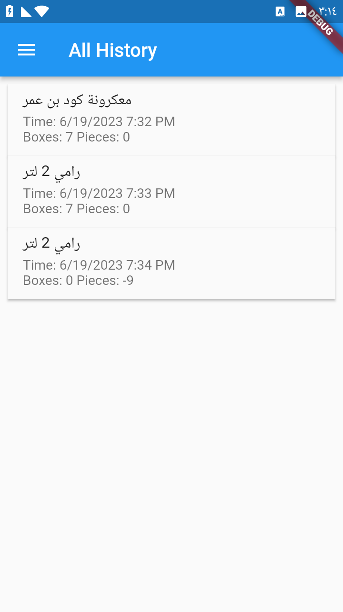

# Spoket Mobile App (Inventory management)

## Overview
The inventory management app revolutionizes inventory operations for grocery stores, providing an efficient and user-friendly solution. With its intuitive interface and powerful features, store owners can effortlessly organize and track their inventory, ensuring optimal stock levels and reducing the risk of stockouts or overstocking. The app's convenient categorization system allows for easy navigation and quick access to product information. Additionally, the app's history feature enables store owners to keep track of product additions and removals, facilitating accurate inventory management. By utilizing this app, grocery stores can enhance productivity, streamline operations, and deliver a seamless shopping experience to their customers.

## Technology Stack
The Inventory Mobile App is developed using the following technologies:

- Framework: Flutter
- State Management: GetX
- Database: SQfLite (Local Database)
- UI Design: Material Design guidelines

## Features
The Spoket Mobile App offers the following features:

1. Home Page
   - 
   - Displays a list of product categories.
   - Each category is represented by Card with its name.
   - Users can tap on a category to view the products within that category.
   - "Add" button for adding a new product .
   - Search for products by the name

2. Category View
   - 
   - Shows a list of products belonging to a specific category.
   - Users can scroll through the products and view essential details like the number of the available Boxes and Individual Pieces.
   - Provides options to delete the category.

3. Add Product
   - 
   - Allows users to add new products to the inventory.
   - Users can enter details such as name, category, quantity, and number of pieces in the box.
   

4. Search Functionality
   - 
   - Enables users to search for specific products by name or category.
   - Displays search results .

5. Product Details Page
    - 
    - Displays detailed information about a specific product.
    - Includes attributes such as product name, categoryand available boxes and individual pieces.
    - Allows users to delete the product directly from the details page.
    - Allows users to add / remove number of boxes or pieces to / from the inventory
.
6. History Log
   - 
   - displays a record of the actions performed on the inventory, specifically the addition and removal of quantities for specific products or all products.
   - Timestamp: Indicates the date and time when the action was performed.

## Installation
To install and run the Inventory Mobile App locally, follow these steps:

1. Clone the repository: `git clone <repository-url>`
2. Navigate to the project directory: `cd stock_manager`
3. Install dependencies: `flutter pub get`
4. Run the app on a connected device or emulator: `flutter run`

## Conclusion
The Inventory Mobile App simplifies inventory management for grocery store owners. With its user-friendly interface and essential features like category organization, adding new products, and search functionality, it enhances productivity and efficiency in inventory tracking.
